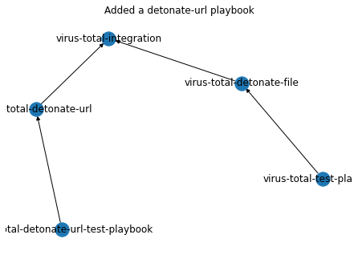

# This will take a pre-built graph:

* Pack:  
    * VirusTotal  
        * Integration  
            id: virus-total-integration  
        * Playbook:  
            id: virus-total-detonate-file  
            depends-on: virus-total-integration  
        * TestPlaybook:  
            id: virus-total-test-playbook  
            deprends-on: virus-total-detonate-file  


* Map:  


To generate the readme:

```shell
jupyter nbconvert --ClearMetadataPreprocessor.enabled=True --ClearOutput.enabled=True --to markdown README.ipynb
```


```python
import networkx as nx
import pylab as plt

graph = nx.DiGraph()
vt_integration = 'virus-total-integration'
vt_pbook = 'virus-total-detonate-file'
vt_tpbook = 'virus-total-test-playbook'
graph.add_nodes_from([vt_integration, vt_pbook, vt_tpbook])
graph.add_edge(vt_tpbook, vt_pbook)
graph.add_edge(vt_pbook, vt_integration)
nx.draw_networkx(graph)
plt.title('Basic Graph')
plt.show()

```


    

    


```python
vt_pbook_url = 'virus-total-detonate-url'
vt_tpbook_url = 'virus-total-detonate-url-test-playbook'
graph.add_nodes_from([vt_pbook_url, vt_tpbook_url])
graph.add_edge(vt_tpbook_url, vt_pbook_url)
graph.add_edge(vt_pbook_url, vt_integration)
nx.draw(graph, with_labels=True)
plt.title('Added a detonate-url playbook')
plt.show()
```


    

    


```python
cs_integration = 'cs-integration'
cs_pbook = 'cs-pbook'
cs_tpbook = 'cstpbook'
graph.add_nodes_from([cs_integration, cs_pbook, cs_tpbook])
graph.add_edge(cs_tpbook, cs_pbook)
graph.add_edge(cs_pbook, cs_integration)
nx.draw(graph, with_labels=True)
plt.title('With CS Integration')
plt.show()
```


    

    


```python
graph.out_edges(vt_tpbook)
```


    OutEdgeDataView([('virus-total-test-playbook', 'virus-total-detonate-file')])


```python
graph.in_edges(vt_integration)
```


    InEdgeDataView([('virus-total-detonate-file', 'virus-total-integration'), ('virus-total-detonate-url', 'virus-total-integration')])


```python
graph_with_cycles = nx.DiGraph()
graph_with_cycles.add_nodes_from((1, 2, 3, 4, 5))
graph_with_cycles.add_edges_from([(1, 2), (2, 3), (3, 1), (4, 5)])
plt.title('graph with cycles')
nx.draw_networkx(graph_with_cycles)
plt.show()
print(f'Cycles found: {nx.find_cycle(graph_with_cycles)}')
```


    

    


    Cycles found: [(1, 2), (2, 3), (3, 1)]


## Example of writing/reading networkx


```python
import time
import tempfile
with tempfile.NamedTemporaryFile() as pickled_file:
    write_t = time.perf_counter()
    nx.write_gpickle(graph, pickled_file.name)
    write_speed = time.perf_counter() - write_t
    read_t = time.perf_counter()
    loaded = nx.read_gpickle(pickled_file.name)
    read_speed = read_t - time.perf_counter()
nx.draw_networkx(loaded)
plt.title(f'write/read with pickle')
plt.show()
print(f'{write_speed=}')
print(f'{read_speed=}')
```


    

    


    write_speed=0.0002606670022942126
    read_speed=-0.00035983300767838955


## Pros and Cons

### Pros

* We can use the networkx binary file (pickled) to cache the changes
* It's quicker to make changes than manual

### Cons

* It requires a learning curve if you did not did the Graphs & Algorithm course.
* It is still 10x times slower than using a database or other solutions. [igraph](https://igraph.org/python/) for example, is much faster and requries the same effort as using the network package.

## Recommendations

* Moving to igraph shouldn't be much more than using the networkx pack. Consider moving to it.
* Because no one is creating the ID-Set in it's environment - Create an optional module that can be optionally installed `pip install demisto-sdk[id-set]`.
* Create a post commit that reject changes on failed master (especially ID-Set).
